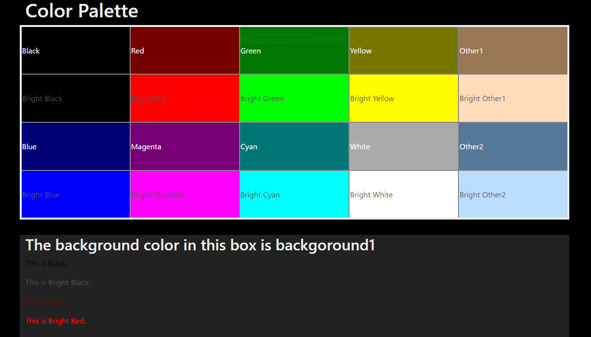

# colorpalette

Simple color palettes generator for editors or IDEs.

## What is this?

A color palette generator for those who create color themes such as editors and IDEs.
Easy to use and works locally.

## How to use?

1. Download this repo.
2. Edit variables in index.css
3. Open index.html on editor

## Sample

## LICENSE

MIT